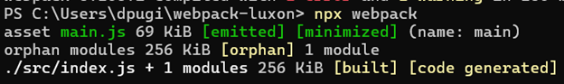
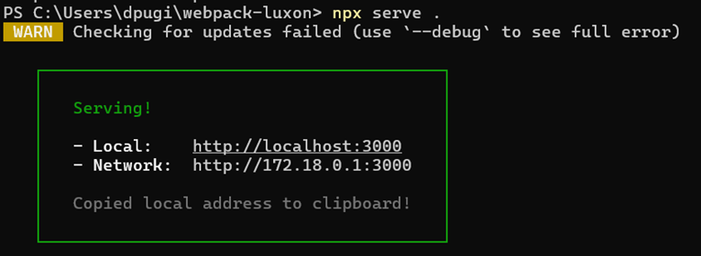
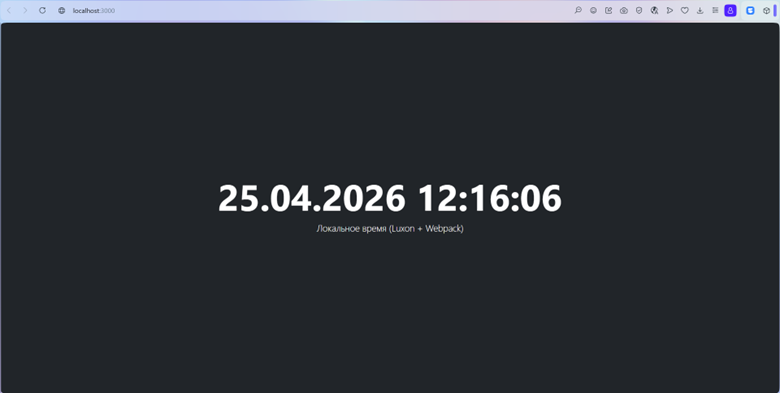
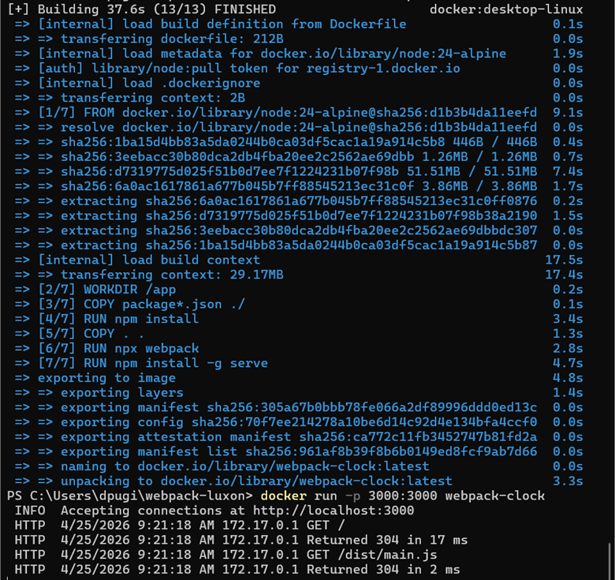
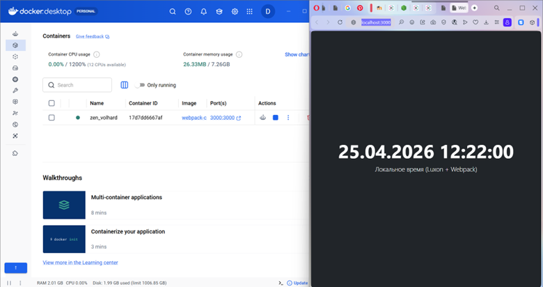
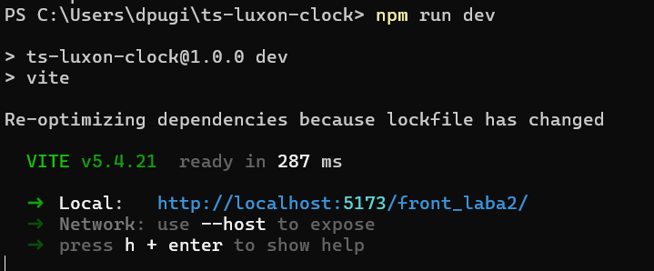
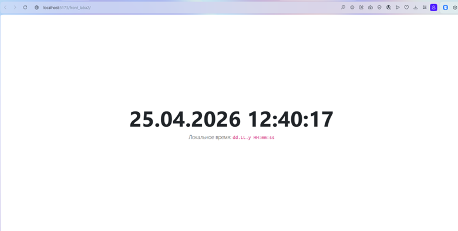
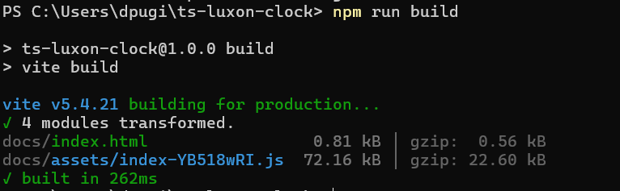
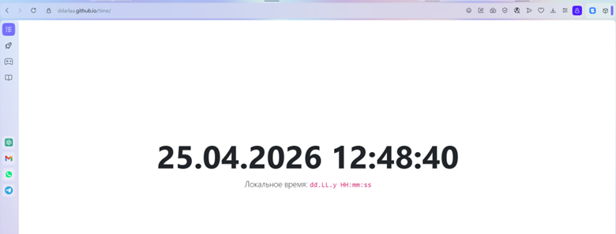

## Часть 1. Сборка с Webpack + запуск в Docker

### Цель
Создать статическую страницу с часами на Luxon, собрать её с помощью Webpack, запустить в Docker-контейнере.

### Инструменты
- Node.js 24 (образ `node:24-alpine`)
- Webpack 5
- Luxon
- Bootstrap (CDN)
- Docker

### Ход работы

1. Инициализирован npm-проект, установлен `luxon` и dev-зависимости `webpack webpack-cli serve`.
2. Создан `src/index.js` с импортом Luxon и обновлением времени каждую секунду.
3. Создан `index.html` с подключением Bootstrap для адаптивности и крупным отображением времени (класс `display-1`).
4. Выполнена сборка командой `npx webpack`. Результат сборки:




5. Страница проверена локально через `npx serve .`. Вид в браузере:



### Запуск в Docker

Создан `Dockerfile`.
Сборка образа и запуск контейнера:
```
bash
docker build -t webpack-clock .
docker run -p 3000:3000 webpack-clock
```

Результат – приложение доступно на http://localhost:3000


## Часть 2. TypeScript + Luxon + Vite и деплой на GitHub Pages
### Цель
Освоить связку Vite + TypeScript, автоматизировать деплой статической страницы на GitHub Pages.

### Инструменты
- Vite 5.x
- TypeScript 5.6
- Luxon
- Bootstrap (CDN)
- GitHub Pages (из ветки main, папка docs)
### Выполнение
Проект создан с помощью npm init -y, установлены vite, typescript, luxon.

Настроен tsconfig.json для ESNext и Bundler-резолюции.





После отправки кода на GitHub и настройки Pages (Source: Deploy from a branch, branch: main, folder: /docs) сработала публикация.
Финальная страница доступна по адресу: ddarlaa.github.io/time

