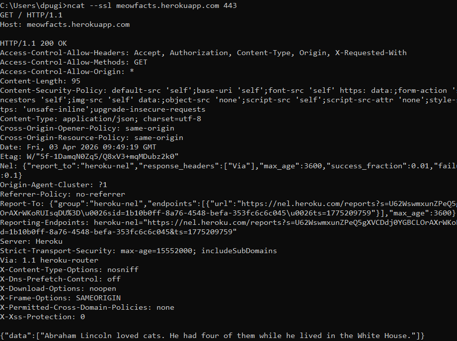
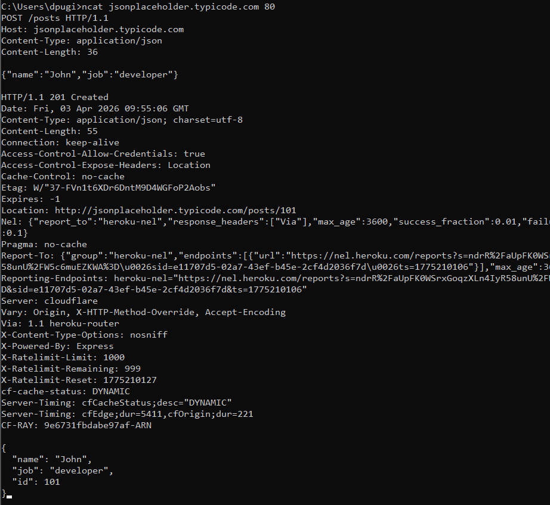
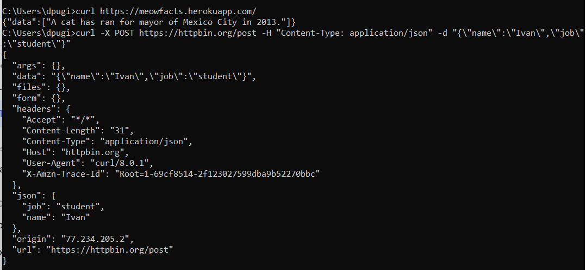
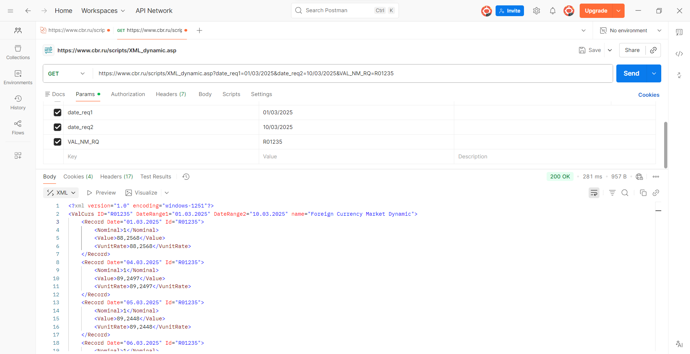

# Отчёт по лабораторной работе: Протокол HTTP. Клиент-серверное взаимодействие

## Цель работы
Изучить основы протокола HTTP, научиться формировать и отправлять GET и POST запросы с помощью различных инструментов (Ncat, cURL, Postman), а также получить данные от API Банка России.

## Используемые инструменты
- **Ncat** – утилита для ручного формирования HTTP-запросов (поддерживает SSL, входит в состав Nmap)
- **cURL** – встроенная утилита Windows 10/11 для работы с HTTP из командной строки
- **Postman** – графический клиент для тестирования API
- **API Банка России** – официальный источник курсов валют (`https://www.cbr.ru/development/sxml/`)

---
## Ход работы
### GET запрос с использованием ncat (telnet не принимал HTTPS)
Используем публичное API meowfacts.herokuapp.com, которое возвращает случайный факт о кошках в формате JSON.

### POST запрос с использованием ncat
**Используем команду для подключения к ресурсу, не требующего аутентификации (во избежании ошибки 401 Unauthorized)**

- ncat jsonplaceholder.typicode.com 80

**Вводим POST-запрос:** 

- POST /api/users HTTP/1.1
- Host: reqres.in
- Content-Type: application/json
- Content-Length: 36
- {"name": "John Doe", "job": "developer"}
  
**Получаем ответ от сервера 201 Created с созданным пользователем**

### GET и POST запросы через cURL 
**Утилита curl встроена в Windows 10/11 и позволяет отправлять запросы одной строкой**

###  Работа с Postman и API Банка России 
Используем API ЦБ РФ: https://www.cbr.ru/development/sxml/

**API ЦБ РФ предоставляет курсы валют в формате XML. Для получения динамики курса доллара США за первые 10 дней марта 2025 года используем следующий URL:**

https://www.cbr.ru/scripts/XML_dynamic.asp?date_req1=01/03/2025&date_req2=10/03/2025&VAL_NM_RQ=R01235

## Заключение
В ходе лабораторной работы я:
- освоила ручное формирование HTTP-запросов через Ncat (в том числе с SSL);
- научилась использовать cURL для быстрой отправки GET и POST запросов;
- приобрела навык работы с профессиональным инструментом Postman;
- успешно получила актуальные курсы валют от API Банка России.

Все инструменты работают корректно, полученные ответы серверов соответствуют спецификации протокола HTTP. Полученные навыки пригодятся при разработке и тестировании веб-приложений, а также при автоматизации получения данных из открытых API.

